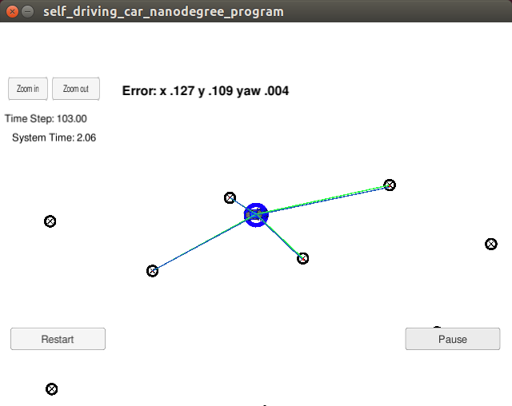
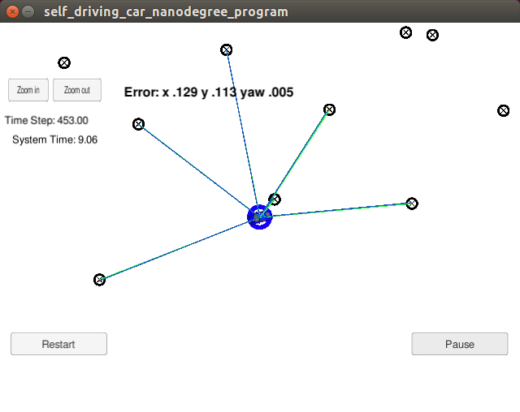
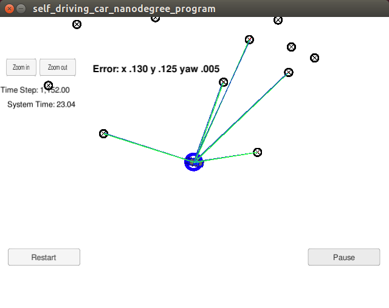
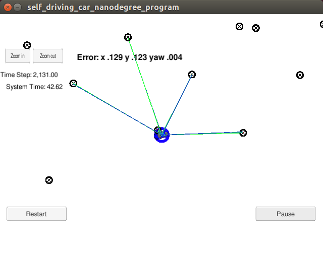

# CarND-Kidnapped-Vehicle-Project
Self-Driving Car Engineer Nanodegree Program

---

## Implementation

The particle filter implementation is similar to the one introduced in class.

In `ParticleFilter::init()`, I used `std::normal_distribution` and `std::default_random_engine` to generate random particles according to gaussian distribution. Both the mean and the standard deviation are given as input arguments. All particles will receive equal weight of 1.0 during initialization.

In `ParticleFilter::prediction()`, I need to use a motion model to predict each particle one step into the future. I use the Bicycle Motion Model presented in class. However, there is the caveat --- I need to treat the case of `yaw_rate=0` separate from `yaw_rate!=0`. When `yaw_rate!=0`, I apply the bicycle motion model; but when `yaw_rate=0`, I simply use the constant velocity and yaw angle model. Motion noise is added similar to initialization step.

`ParticleFilter::updateWeights()` is the most complex and the key step in the whole pipeline. I further break it down into multiple steps:

1. Transform observations to map coordinate
2. Compute predicted measurements
3. Associate predicted measurements to actual measurements
4. Compute new weight using multi-variate Gaussian distribution
5. Update particles and weights

For coordinate transform, I use the following equation
```
P_w = [cos -sin  * P_v + [v.x
       sin  cos]          v.y]
```

To compute predicted measurements, I compute distance from current particle to all landmarks and only consider landmarks that are within `sensor_range`.

For data association, I used the nearest neighbor. I implemented `ParticleFilter::dataAssociation()` and called it during this step.

`ParticleFilter::resample()` is fairly straight-forward as long as I use the `std::discrete_distribution` class. After resample step, all particles again have equal weight of 1.

## Parameters
I chose 100 particles.

## Screenshots





